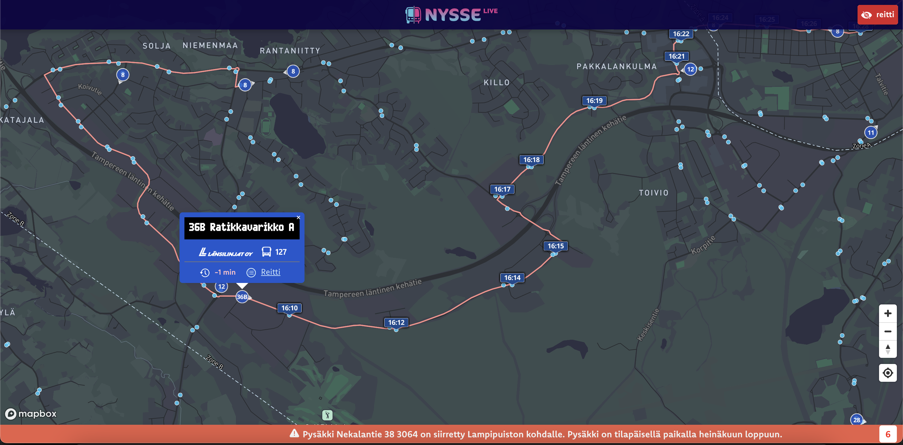
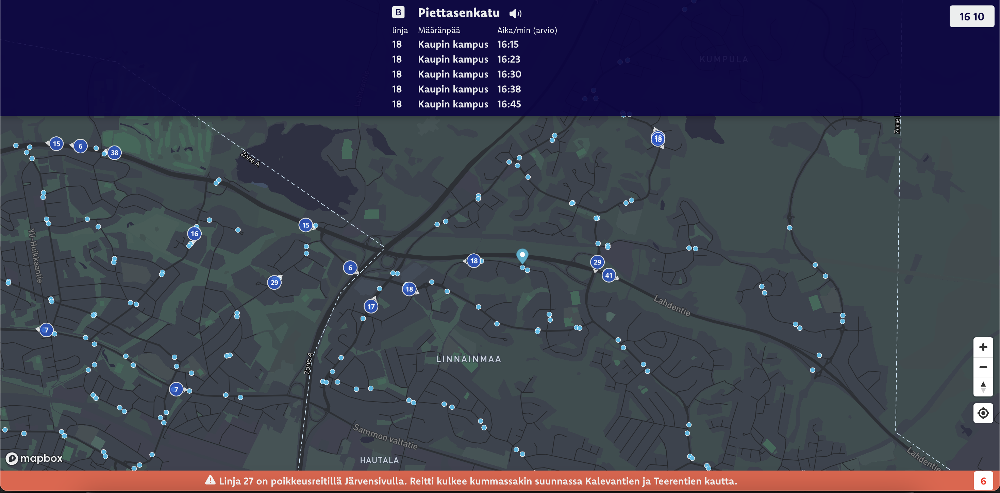
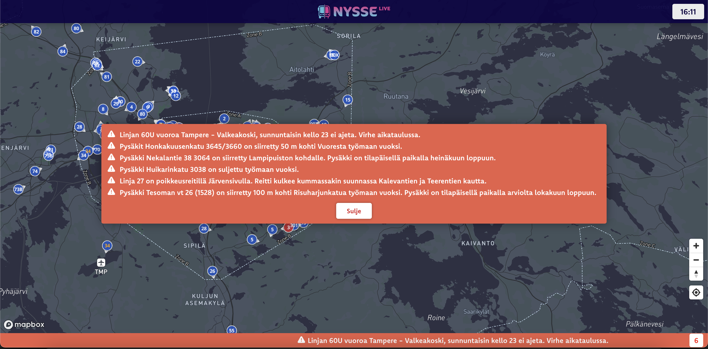

# Nysse LIVE

This React Mapbox JS application is used to track the public transportation system in Tampere.

### Features
- Bus and tram position updates every 3 seconds
- Vehicle popup information displaying line number, destination, operator, bus number and delay in minutes
- Show line route on map (shape)
- Show timetable data on map (expected arrival times)
- Bus-stop popup information displaying bus-stop name, zone location and the next 5 departures as well as their expected arrival times
- Alert/disruption information is shown on the bottom of the display (if any). Click on the alert count icon to open detailed view of alerts.

### Work in progress
- Vehicle line number on top of the vehicle icons on the map are overlapping eachother
- Smooth transitions between position updates

